# 基于SpringBoot的中小型医院网站 / SpringBoot-based Hospital Management System


## 项目简介  
基于 Spring Boot 2.7+ 和 MyBatis Plus 的医院管理系统，整合 Shiro 权限框架与 MySQL 数据库，实现患者在线预约挂号、医师诊疗管理、药品库存监控等核心功能，采用前后端分离架构提升系统可维护性。

## 核心技术  
- Spring Boot 2.7+  
- MyBatis-Plus 3.5.3+  
- Shiro 1.3.2  
- MySQL 8.0+  
- Hutool 4.0.12  
- Fastjson 1.2.8  

## 特征介绍  
- ​**​权限控制​**​：集成 Shiro 实现动态角色权限管理，包含登录拦截器与自定义鉴权注解  
- ​**​数据持久化​**​：MyBatis-Plus 增强 CRUD 操作，支持多表关联查询与 XML 映射文件  
- ​**​模块化设计​**​：分离 entity/view/vo 三层数据模型，实现业务逻辑与视图解耦  
- ​**​文件管理​**​：独立 FileController 处理文件上传下载，配置静态资源访问路径  
- ​**​工具集成​**​：整合 Hutool 工具包实现数据加密，Fastjson 处理 JSON 序列化  
- ​**​监控支持​**​：内置 Druid 连接池监控，配置 MyBatis Plus 性能分析插件  

## 代码结构
```
src/
├── main/
│   ├── java/
│   │   ├── com/
│   │   │   ├── annotation/          # 权限注解(LoginUser/IgnoreAuth)
│   │   │   ├── config/              # Shiro配置/MyBatisPlus配置
│   │   │   ├── controller/          # 业务控制器(药库/缴费/门诊)
│   │   │   ├── entity/              # 数据实体(视图/模型/VO)
│   │   │   ├── interceptor/         # 权限拦截器
│   │   │   ├── service/             # 服务层及实现类
│   │   │   ├── utils/               # 百度API/文件处理工具
│   ├── resources/
│   │   ├── mapper/                  # MyBatis XML映射文件
│   │   ├── application.yml          # 主配置文件
│   │   ├── static/                  # 前端静态资源
```
## 使用说明
​**​运行环境​**​  
- JDK 1.8+  
- MySQL 5.7+  
- Maven 3.6+

​**​配置步骤​**​  
1. 创建数据库 `springbootil5n0` 并导入 SQL 文件  
2. 修改 application.yml 中的数据库连接配置：  
```yaml
spring:
  datasource:
    url: jdbc:mysql://localhost:3306/springbootil5n0
    username: root
    password: 123456
```

# 项目实际截图：
## 登录：


## 前台：
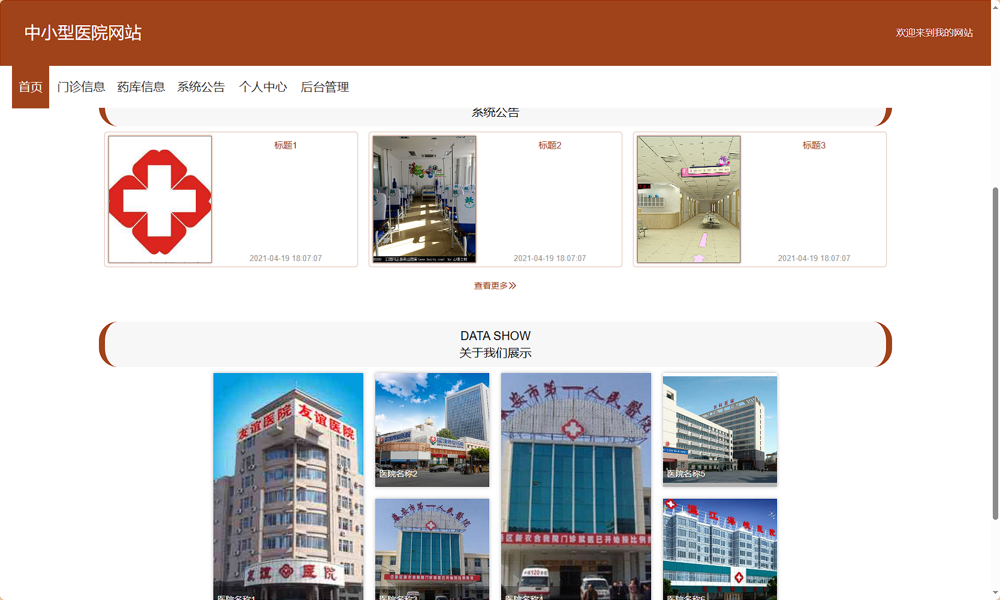

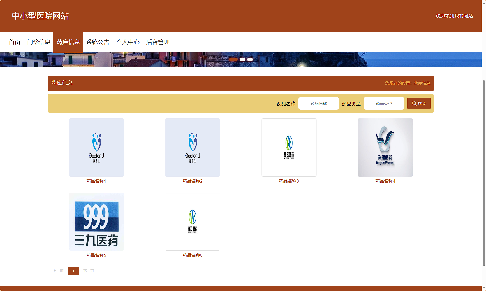
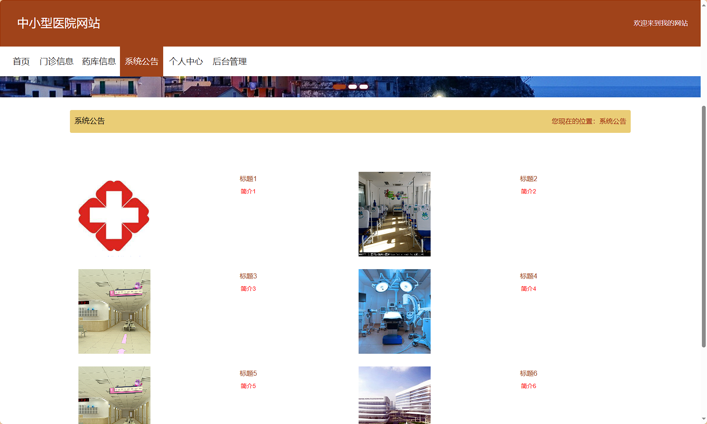

## 后台：
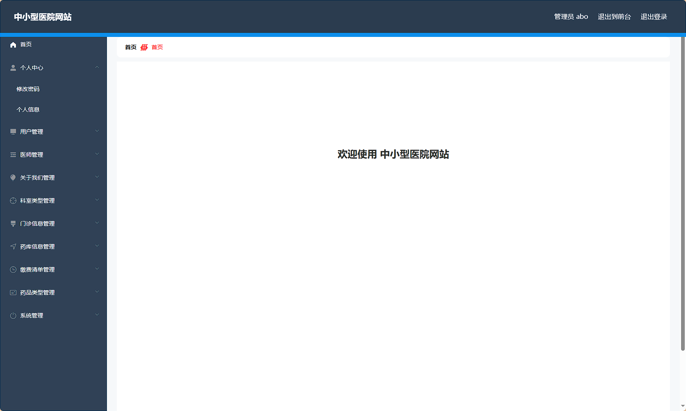
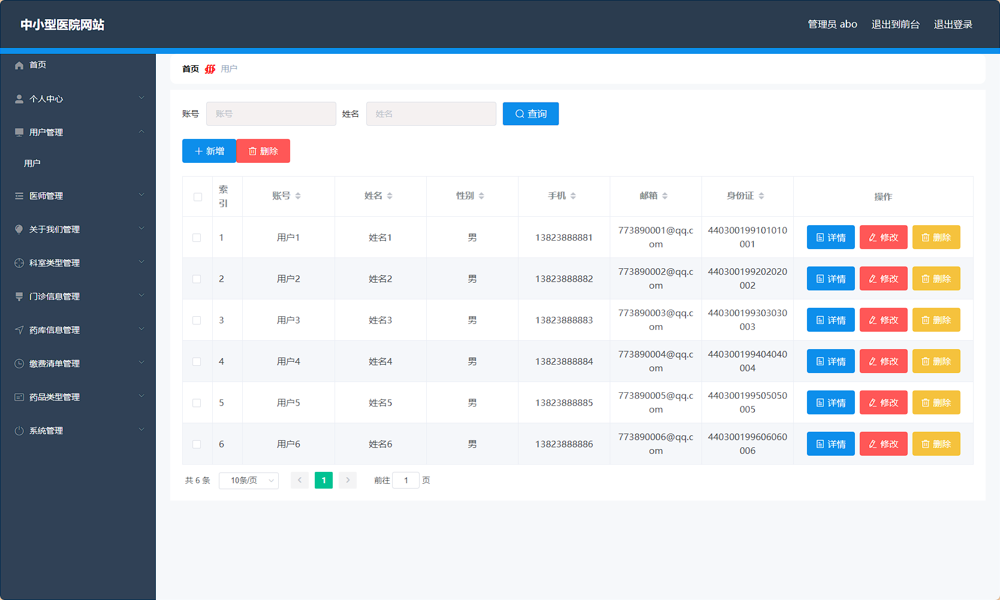
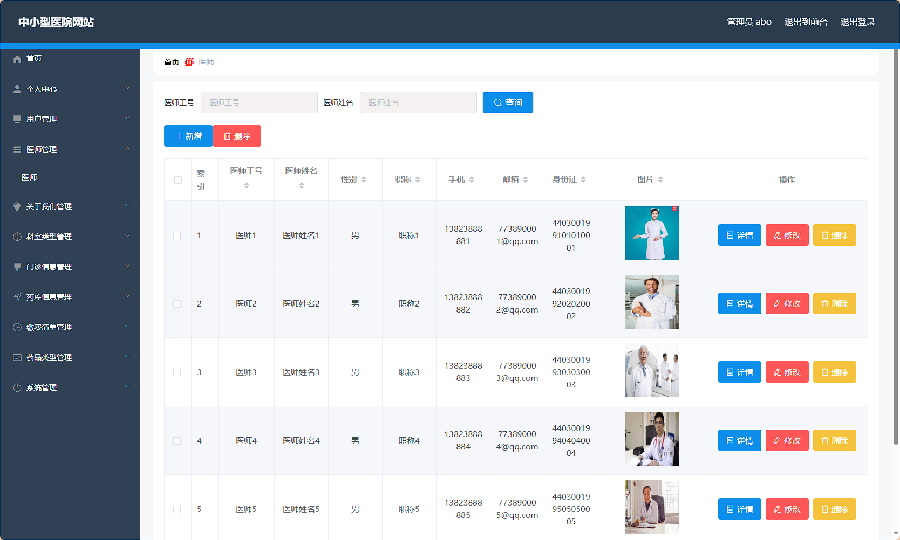
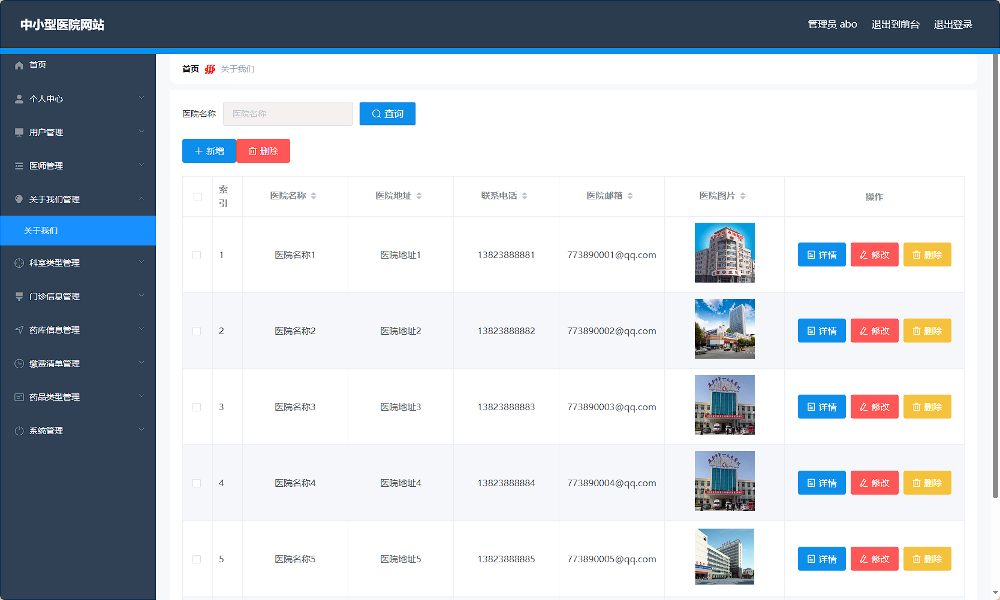
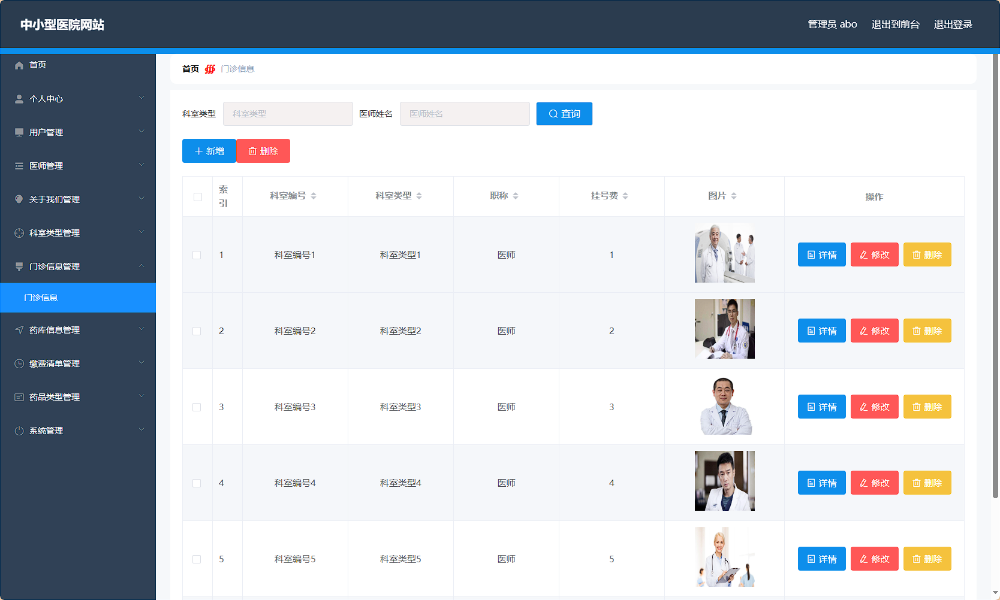
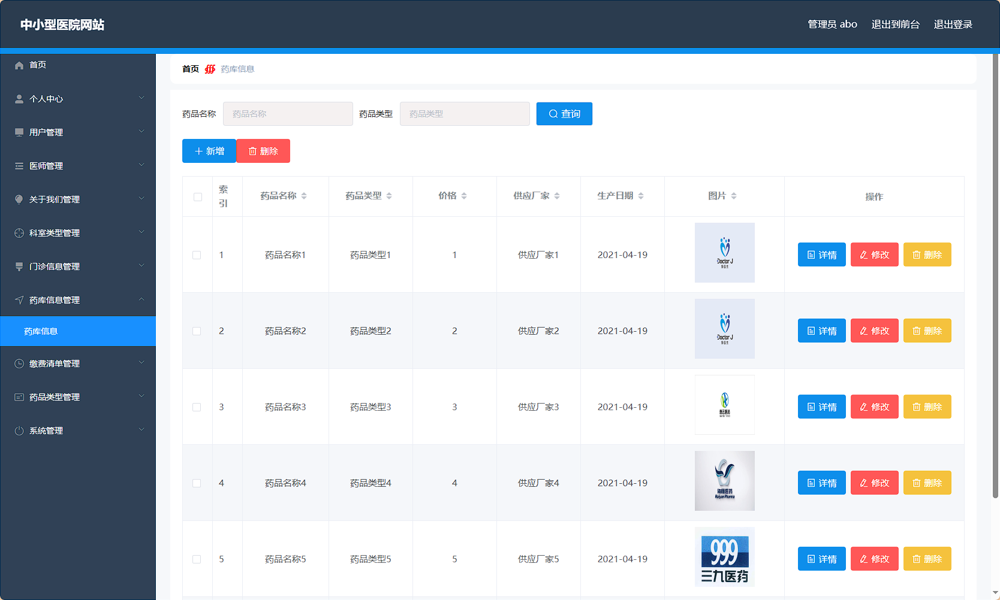
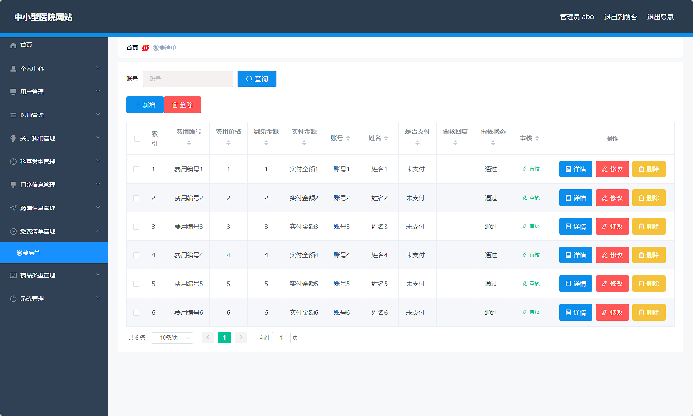

> 等等...

# 精选项目导航 & 快速部署工具
## 项目资源一站直达
- ​**访问项目导航站**：[点击进入](http://sysadmin.3vfree.vip)**快速检索所需项目名称**
- ​**技术栈全覆盖**：Java/SSm/Spring Boot/小程序等主流技术方案
- ​**配套资源**：每个项目均提供部署文档 + 演示视频（附效果截图）

### ▌导航站预览
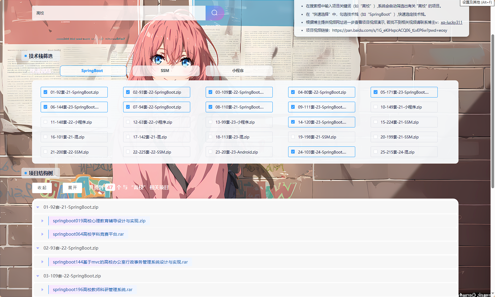

### ▌工具界面预览
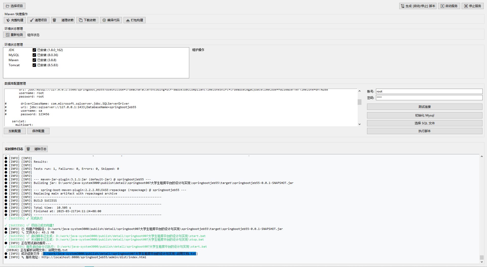

## 捐赠
> 博主将持续更新Java全栈开发项目，包含ssm，springboot，前后端分离系统等项目。
> 此外如果您够宽裕，请博主喝杯咖啡吧！捐赠将用于服务器维护与开源社区建设，感谢您的认可！
> 如需更多Java相关项目毕设3000+，有其他项目需求，sql文件等可联系博主v:xq-lucky311

---